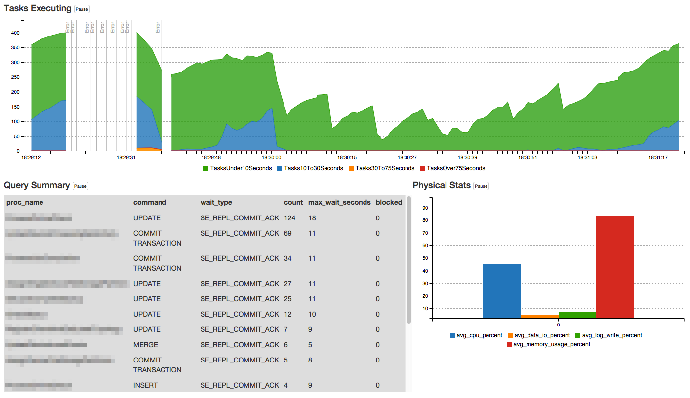

##### May 15, 2015

I love the feeling that comes from seeing data in a new way. A way that says, "how did I get by before this?" One of those moments came recently after going beta with our internal SQL Azure monitoring tool.

Using a hosted database platform is wonderful and terrifying. Most of the time it works like a dream, and a huge bonus is that I don't have to think about hardware. But occasionally it fails, or just doesn't work as expected. In fact, developers are urged to [design for failure], which is not a bad thing (http://blogs.msdn.com/b/kdot/archive/2014/10/12/my-top-5-topics-to-consider-when-designing-apps-for-azure.aspx). 

Because we are growing quickly, we decided that we needed better insight into what was happening on the thousands of SQL Azure databases that we manage, something that could tell us immediately whether something was wrong. And not just "working" or "not working", but a detailed snapshot.

This tool helps answer three basic questions:

1. *When*: At this exact time, what did the load look like?
2. *What*: Which queries are executing, what are they doing, and how long are they taking?
3. *Why*: Are we constrained by resources such as CPU or I/O?

Here's a view during a recent period of heavy load. The top chart shows a time series that indicates the total number of tasks executing, grouped by how long they have been running. See the gaps on the left side of the chart? That's when we had "too many" tasks running at once, based on our selected performance tier, and couldn't measure the actual load.

Basically, if the time series chart is mostly green and blue, then things are getting done quickly (unless there are too many things at once). The table on the bottom lists the stored proc names, the SQL command that's executing, and the SQL wait type (if any). The bar chart on the bottom right shows the physical resource usage, like CPU, I/O, and memory. The entire page is updated each second, so we can immediately know the results of any change that is made.

*Note*: I had to redact the names of the stored procedures, like "MagicStoredProcThatDoesEverything".

Here are the queries used for the charts.

For the top chart, we group running tasks by the amount of time they have been running. This gives a visual indication of how much work is actually getting done by the server.

<pre>
SELECT format(getutcdate(), 'HH:mm:ss') [TimeUTC]
    ,sum(CASE 
            WHEN total_elapsed_time < 10000
                THEN 1
            ELSE 0
            END) [TasksUnder10Seconds]
    ,sum(CASE 
            WHEN total_elapsed_time BETWEEN 10000
                    AND 30000
                THEN 1
            ELSE 0
            END) [Tasks10To30Seconds]
    ,sum(CASE 
            WHEN total_elapsed_time BETWEEN 30000
                    AND 75000
                THEN 1
            ELSE 0
            END) [Tasks30To75Seconds]
    ,sum(CASE 
            WHEN total_elapsed_time > 75000
                THEN 1
            ELSE 0
            END) [TasksOver75Seconds]
FROM sys.dm_exec_requests
</pre>

For the table, we mostly are interested in stored procedure names, but also want to know if a literal command is being run, so we show the hostname and part of the query if that's the case. We also look for tasks that are blocked by others, and exclude the task that's running itself:

<pre>
SELECT CASE 
        WHEN object_name(sqltext.objectid) IS NULL
            THEN s.host_name + ': ' + left(sqltext.TEXT, 30)
        ELSE object_name(sqltext.objectid)
        END [proc_name]
    ,command
    ,wait_type
    ,count(*) [count]
    ,max(r.total_elapsed_time / 1000) [max_wait_seconds]
    ,count(CASE 
            WHEN blocking_session_id > 0
                THEN 1
            END) [blocked]
FROM sys.dm_exec_requests r
CROSS APPLY sys.dm_exec_sql_text(sql_handle) AS sqltext
JOIN sys.dm_exec_sessions s ON r.session_id = s.session_id
WHERE NOT (
        s.host_name = host_name()
        AND command = 'SELECT'
        AND wait_type IS NULL
        )
GROUP BY CASE 
        WHEN object_name(sqltext.objectid) IS NULL
            THEN s.host_name + ': ' + left(sqltext.TEXT, 30)
        ELSE object_name(sqltext.objectid)
        END
    ,command
    ,wait_type
ORDER BY 4 DESC
</pre>

The physical stats chart is a simple query from a SQL Azure Dynamic Management View. New data in this DMV is available every 15 seconds. Note that this DMV is only available for Standard and Premium databases; the old Business edition doesn't have it.
<pre>
SELECT TOP 1 avg_cpu_percent
    ,avg_data_io_percent
    ,avg_log_write_percent
    ,avg_memory_usage_percent
FROM sys.dm_db_resource_stats
ORDER BY end_time DESC
</pre>

## So...does it work?

It's become an essential tool for monitoring and troubleshooting, and isn't even finished yet. 

Looking at the example image above, we knew something was wrong because we were hitting concurrent request limits on Azure, but (1) the physical resource usage wasn't maxed out, and (2) the wait types were different from what we are used to seeing. We opened a case with Microsoft and they quickly identified a back-end issue, and worked to resolve it.

## Technologies used

The tool is built with ASP.NET and [SignalR](http://signalr.net/) on the server side. For the chart display, I used the excellent [C3.js](http://c3js.org/) library which hides most of the gory details of the also excellent [D3](http://d3js.org/). The SQL query results are all sent as JSON, which is easy for C3 to read.